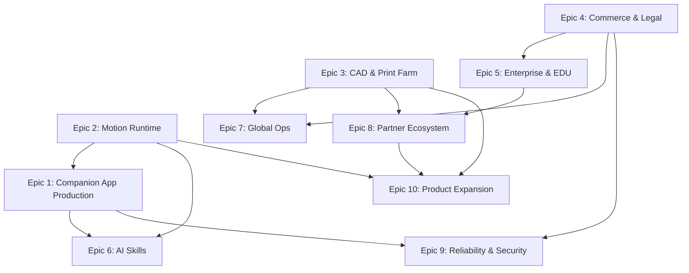

# Exobod.ai Roadmap V2 — Next 100 Strategic Steps

Post-foundation roadmap organized as **10 EPICS × 10 steps** (steps 101–200). Assumes V1 phases A–H are substantially complete: leads, catalog, configurator, quote pipeline, manufacturing MVP, and companion app alpha.

**North star (unchanged):** Configure → validate → quote → build → ship → run on device.

**Cadence:** 2-week sprints, one epic per sprint (Sprints 1–10).

---

## Sprint schedule

| Sprint | Weeks | Epic | Steps | Theme |
|--------|-------|------|-------|-------|
| 1 | 1–2 | Epic 1 | 101–110 | Companion App Production |
| 2 | 3–4 | Epic 2 | 111–120 | Motion Runtime & MCU Firmware |
| 3 | 5–6 | Epic 3 | 121–130 | 3D/CAD Pipeline & Print Farm |
| 4 | 7–8 | Epic 4 | 131–140 | Commerce & Legal at Scale |
| 5 | 9–10 | Epic 5 | 141–150 | Enterprise & EDU Procurement |
| 6 | 11–12 | Epic 6 | 151–160 | AI Skills & LLM Orchestration |
| 7 | 13–14 | Epic 7 | 161–170 | Global Ops & Fulfillment |
| 8 | 15–16 | Epic 8 | 171–180 | Partner Ecosystem & Marketplace |
| 9 | 17–18 | Epic 9 | 181–190 | Platform Reliability & Security |
| 10 | 19–20 | Epic 10 | 191–200 | Product Line Expansion |

**Total horizon:** ~20 weeks (5 months) at 2-week sprint cadence.

---

## Epic 1: Companion App Production

**Goal:** Ship production-grade iOS and Android companion apps with store listings, OTA firmware delivery, and opt-in telemetry for support.

**Dependencies:** V1 steps 65–66 (serial registry, firmware profiles), 73–80 (companion alpha), 84–86 (telemetry/OTA/store stubs).

**Acceptance criteria:**
- Apps published on App Store and Google Play with hardware serial verification gate
- OTA firmware push with staged rollout and one-tap rollback
- Opt-in telemetry dashboard visible to support with battery, servo temp, fault codes
- Crash-free sessions > 99% on reference devices (iPhone 14+, Pixel 7+)
- Onboarding completes in < 3 minutes for 90% of test users

**Quality gate checklist:**
- [ ] App Store / Play Store review assets and privacy nutrition labels approved
- [ ] Serial verification rejects unregistered or RMA'd units
- [ ] OTA rollback tested on 3 firmware versions
- [ ] Telemetry PII scrubbed; opt-in consent logged per device
- [ ] E-stop reachable within one tap from every screen
- [ ] Offline mode degrades gracefully (no motion without BLE)
- [ ] `exobod-quality-gate` skill passed on companion repo PRs

### Steps (101–110)

- [ ] **101.** Harden Expo/React Native monorepo for release builds — separate dev/staging/prod schemes, code signing, and CI artifact pipeline.
- [ ] **102.** App Store Connect + Google Play Console listings: screenshots, safety disclaimers, age rating, hardware requirement copy.
- [ ] **103.** Serial verification API — app rejects pairing if serial not in unit registry or order status ≠ `delivered`.
- [ ] **104.** Production onboarding flow: QR scan → claim → safety acknowledgment → BLE pair with progressive troubleshooting.
- [ ] **105.** OTA firmware channel architecture — stable / beta rings tied to serial cohort; manifest signed and version-pinned.
- [ ] **106.** Staged OTA rollout — 5% → 25% → 100% with automatic halt on fault-code spike.
- [ ] **107.** One-tap firmware rollback UI with "last known good" profile from manufacturing flash.
- [ ] **108.** Opt-in telemetry pipeline — battery %, servo temps, motion fault codes, BLE drop rate; batched upload with user consent token.
- [ ] **109.** Support-facing telemetry dashboard — filter by serial, firmware version, fault class; deep link from build desk.
- [ ] **110.** Store release train — monthly app release cadence synced with firmware catalog version.

---

## Epic 2: Motion Runtime & MCU Firmware

**Goal:** Production motion runtime on onboard MCU with deterministic primitives, real-time safety governor, and versioned firmware profiles per body/tier.

**Dependencies:** Epic 1 steps 105–107 (OTA infra), V1 steps 16, 21, 66 (BOM, skill packs, firmware flash).

**Acceptance criteria:**
- Motion primitives execute within ±10% of specified duration on all supported bodies
- Safety governor blocks 100% of out-of-envelope commands in fuzz testing
- Firmware profile diff visible per serial; flash verified at QC and post-OTA
- MCU watchdog recovers from BLE dropout without runaway servo
- Motion primitive library documented with joint envelopes per body type

**Quality gate checklist:**
- [ ] E-stop cuts all PWM within 50 ms on hardware bench
- [ ] Joint limit violations rejected at firmware layer, not just app
- [ ] Firmware images signed; unsigned images rejected
- [ ] Regression suite runs on Walker + Rover reference rigs
- [ ] Brownout / low-battery motion inhibit tested
- [ ] Version string exposed over BLE and logged on connect

### Steps (111–120)

- [ ] **111.** MCU firmware architecture lock — FreeRTOS/Arduino core choice, servo driver abstraction, BLE GATT service map.
- [ ] **112.** Motion primitive runtime — queue, interpolation, estop preemption, per-primitive max duration enforcement.
- [ ] **113.** Safety governor on MCU — joint limits, speed caps, torque ceilings; fail-closed on sensor fault.
- [ ] **114.** Firmware profile schema v2 — body, tier, skill pack, accessory port map; diffable JSON blobs.
- [ ] **115.** Manufacturing flash station integration — profile ID written to EEPROM + logged to serial registry.
- [ ] **116.** BLE protocol v1 spec — motion commands, status telemetry, firmware version, fault codes; document for app team.
- [ ] **117.** Walker biped primitive set — wave, nod, present, idle sway; envelope tables in catalog.
- [ ] **118.** Rover primitive set — patrol segment, turn-in-place, stop; geofence hook for app layer.
- [ ] **119.** Watchdog + safe-state on disconnect — hold brake, fade servos to neutral, log `BLE_DROP` fault.
- [ ] **120.** Firmware CI — build matrix per body profile, hardware-in-loop smoke on reference rig.

---

## Epic 3: 3D/CAD Pipeline & Print Farm

**Goal:** Automated CAD/STL generation per configuration, print farm routing with capacity planning, and QC traceability from file to physical part.

**Dependencies:** V1 steps 13–18, 29–30, 59–61 (catalog, 3D preview, work orders, print routing stubs).

**Acceptance criteria:**
- STL package auto-generated for 95% of catalog configurations without manual CAD
- Print jobs routed to internal farm or partner queue with SLA date
- Every printed part traceable to source STL hash + printer + material lot
- Configurator 3D preview matches shipped geometry within documented tolerance
- Print failure rate < 5% on production shell profiles

**Quality gate checklist:**
- [ ] STL manifold check passes before queue submission
- [ ] Material/color matches finish code on work order
- [ ] Print time estimate within 20% of actual for standard shells
- [ ] Post-print dimensional spot-check logged per batch
- [ ] CAD revision pinned on configuration snapshot at order time
- [ ] Partner printer onboarding checklist completed

### Steps (121–130)

- [ ] **121.** Parametric CAD template library — Walker, Desk Assistant, Rover, Utility Helper base meshes with variant slots.
- [ ] **122.** Configuration → STL pipeline — finish color as material tag, accessory mounts as boolean inserts, phone mount core swap.
- [ ] **123.** STL validation gate — manifold, min wall thickness, overhang warnings; block queue on fail.
- [ ] **124.** Print farm job queue — priority by order milestone date, material type, printer capability matrix.
- [ ] **125.** Internal printer fleet registry — model, nozzle, bed size, uptime, maintenance window.
- [ ] **126.** Partner makerspace integration — API or CSV export for job handoff, status webhook, capacity calendar.
- [ ] **127.** Slicer profile per material/finish — PLA+/PETG/ABS presets versioned and tied to catalog finish codes.
- [ ] **128.** Print job → part ID labeling — QR sticker links physical part to work order line item.
- [ ] **129.** Configurator 3D preview sync — R3F assets generated from same parametric source as STL export.
- [ ] **130.** Batch nesting optimizer — group similar shells on shared build plates to reduce lead time.

---

## Epic 4: Commerce & Legal at Scale

**Goal:** Scale quote-to-cash with multi-currency support, tax automation, enforceable legal terms, and audit-ready financial records.

**Dependencies:** V1 steps 45–58 (quote pipeline), 7, 87–93 (legal, trust, compliance stubs).

**Acceptance criteria:**
- Quotes and invoices issued in USD + one pilot currency (EUR or GBP)
- Tax calculated automatically for US + pilot EU region
- Signed SOW archived with immutable hash linked to order
- Refund/cancellation workflow operational with SLA tracking
- Finance export reconciles with Stripe/payment provider monthly

**Quality gate checklist:**
- [ ] No quote sent without catalog version pin and validity date
- [ ] Legal entity and jurisdiction correct on all customer-facing PDFs
- [ ] PCI scope minimized — no raw card data in app logs
- [ ] Refund triggers update order state and manufacturing hold
- [ ] Change-request audit trail complete before re-quote
- [ ] Admin auth required on all quote/order mutation endpoints

### Steps (131–140)

- [ ] **131.** Multi-currency quote display — FX rate source, rounding rules, "indicative vs locked" labeling.
- [ ] **132.** Stripe Tax or equivalent — US sales tax + pilot EU VAT; tax line on quote and invoice.
- [ ] **133.** Contract template versioning — SOW, limitations of liability, warranty; customer locale selection.
- [ ] **134.** Immutable document archive — signed PDFs stored with SHA-256; linked on order record.
- [ ] **135.** Automated deposit invoice on e-sign completion — milestone schedule materialized as Stripe invoices.
- [ ] **136.** Dunning and payment reminder workflow — 7/14/30 day cadence; production pause trigger on overdue mid-milestone.
- [ ] **137.** Refund and cancellation ops playbook wired to admin — partial vs full, restocking, manufacturing abort.
- [ ] **138.** Revenue recognition tags per milestone — deposit / WIP / delivered for finance reporting.
- [ ] **139.** Customer-facing order amendment portal — request scope change → engineering review → revised quote vN.
- [ ] **140.** Annual price list publication — catalog-driven MSRP bands for standard SKUs; custom NRE still quoted.

---

## Epic 5: Enterprise & EDU Procurement

**Goal:** Enable institutional buyers (schools, labs, enterprises) with PO workflows, cohort licensing, supervision policies, and procurement-ready documentation.

**Dependencies:** Epic 4 (commerce/legal), V1 steps 22–23, 38, 88 (EDU bundles, compare configs, supervision).

**Acceptance criteria:**
- PO-based checkout path live for approved institutional accounts
- EDU bundle pricing applied automatically for verified `.edu` / domain allowlist
- Procurement packet (spec sheet, safety doc, W-9/W-8) generatable per quote
- Supervision policy enforced in companion app for EDU serial cohort
- 3 reference institutional deals closed or in contracting

**Quality gate checklist:**
- [ ] EDU orders require supervision acknowledgment at order and app onboarding
- [ ] Volume discount tiers documented and applied consistently
- [ ] PO number captured and searchable in admin
- [ ] Net-30 terms only for credit-approved accounts
- [ ] FERPA-aligned data handling documented for EDU telemetry
- [ ] Institutional SLA response time defined and measurable

### Steps (141–150)

- [ ] **141.** Institutional account entity — domain verification, billing contact, approved payment terms (card / PO / net-30).
- [ ] **142.** PO checkout flow — upload PO PDF, manual/auto approval gate, order created in `pending_po` state.
- [ ] **143.** EDU cohort pricing engine — seat bands, semester bundles, multi-unit classroom kits.
- [ ] **144.** Procurement packet generator — PDF bundle: spec sheet, BOM summary, safety limitations, compliance matrix, tax IDs.
- [ ] **145.** Volume quote builder — line-item discounts at 5/10/25 unit thresholds without manual spreadsheet.
- [ ] **146.** Supervision policy profiles — app session timeouts, motion speed caps, geofence defaults for EDU serials.
- [ ] **147.** Classroom deployment guide — unboxing, charging, Wi-Fi/BLE lab setup, incident reporting for teachers.
- [ ] **148.** Institutional admin dashboard — cohort serial list, firmware ring, usage summary (aggregate, no student PII).
- [ ] **149.** RFP response template library — security, privacy, support SLA, lead time, warranty answers.
- [ ] **150.** Pilot program tracker — 3 anchor EDU/enterprise accounts with success criteria and quarterly business reviews.

---

## Epic 6: AI Skills & LLM Orchestration

**Goal:** Configurable LLM skill layer that translates natural language to safe motion primitives with provider failover, cost controls, and on-device options.

**Dependencies:** Epic 1 (companion app production), Epic 2 (motion runtime), V1 steps 77–78 (voice/LLM stubs).

**Acceptance criteria:**
- User can select LLM provider (OpenAI / Anthropic / Google) or local-only mode
- 100% of LLM outputs pass through motion safety filter before MCU queue
- Routine editor saves and runs "when I say X, do motion Y" on device
- Provider failover restores service within 30 s on primary outage
- Token/cost budget per serial with admin override

**Quality gate checklist:**
- [ ] Prompt injection test suite — no raw motor commands from LLM output
- [ ] Voice data retention policy enforced (local-first default)
- [ ] API keys server-side only; never in mobile bundle
- [ ] Skill pack entitlement checked before executing paid motions
- [ ] Latency budget documented: STT → intent → motion < 2 s p95
- [ ] Offline fallback responses when cloud LLM unavailable

### Steps (151–160)

- [ ] **151.** LLM orchestration service — provider abstraction, request routing, response schema for motion intents.
- [ ] **152.** Motion intent safety filter — allowlist of primitives, parameter clamping, reject hallucinated axes.
- [ ] **153.** Voice pipeline production — on-device STT option (iOS/Android), cloud STT fallback, locale support.
- [ ] **154.** Provider failover — health checks, automatic secondary routing, user-visible status.
- [ ] **155.** Per-serial API budget — daily token cap, spend alerts, hard stop with graceful degradation.
- [ ] **156.** Routine editor v1 — trigger phrase → motion sequence + optional TTS; stored on device, synced optionally.
- [ ] **157.** Skill pack marketplace hooks — unlock motion sets via catalog entitlement flag on serial.
- [ ] **158.** Conversation context window policy — truncate/redact; no PII in persistent logs.
- [ ] **159.** On-device micro-intent classifier — greetings, estop phrases, follow-ups without cloud round-trip.
- [ ] **160.** AI skills observability — intent success rate, filter blocks, provider latency, cost per active serial.

---

## Epic 7: Global Ops & Fulfillment

**Goal:** Ship internationally with customs compliance, multi-region inventory, localized support SLAs, and RMA logistics.

**Dependencies:** Epic 3 (print farm), Epic 4 (commerce), V1 steps 68–71 (shipping, RMA, spares).

**Acceptance criteria:**
- Ship to US + 2 pilot countries with generated customs docs
- Door-to-door tracking visible in customer order portal
- RMA turnaround SLA defined and tracked (< 15 business days target)
- Spare parts orderable from owner portal with serial-linked compatibility
- Regional support hours documented per shipping zone

**Quality gate checklist:**
- [ ] HS codes and declared values correct per SKU on customs forms
- [ ] Lithium battery shipping rules applied per carrier/country
- [ ] RMA serial quarantine prevents re-registration until cleared
- [ ] International return label generation tested
- [ ] Inventory buffer maintained for top 10 spare SKUs
- [ ] Carrier API failure fallback procedure documented

### Steps (161–170)

- [ ] **161.** Multi-carrier shipping integration — EasyPost/ShipStation with rate shop and label print.
- [ ] **162.** Customs documentation automation — commercial invoice, HS code, country of origin from catalog.
- [ ] **163.** Regional fulfillment nodes — US hub live; EU or UK pilot hub or partner 3PL onboarded.
- [ ] **164.** Customer tracking portal — carrier events, estimated delivery, proactive delay notifications.
- [ ] **165.** International warranty and support policy — region-specific terms linked from order portal.
- [ ] **166.** RMA workflow v2 — ticket → diagnose → ship label → quarantine serial → repair/refurb → re-release.
- [ ] **167.** Spare parts storefront — serial-aware compatibility, expedited shipping option, BOM-linked pricing.
- [ ] **168.** Regional inventory buffer — safety stock for servos, mounts, shells per demand forecast.
- [ ] **169.** Support SLA tiers — standard vs enterprise response times; timezone-aware routing.
- [ ] **170.** Ops war room dashboard — orders in flight, SLA breaches, RMA queue depth, carrier exceptions.

---

## Epic 8: Partner Ecosystem & Marketplace

**Goal:** Launch partner programs for print shops, EDU resellers, and accessory makers with revenue share, white-label options, and API access.

**Dependencies:** Epic 3 (print farm), Epic 5 (EDU procurement), V1 steps 94–95 (partner portal stubs).

**Acceptance criteria:**
- Partner portal live with onboarding, tier agreement, and performance scorecard
- Print partners receive jobs via API with acceptance SLA
- Affiliate tracked config links attribute conversions
- 5 active partners producing revenue or fulfilled jobs
- Marketplace lists 3+ third-party accessories with compatibility validation

**Quality gate checklist:**
- [ ] Partner agreements signed before API key issuance
- [ ] Revenue share calculations auditable monthly
- [ ] Third-party accessories pass compatibility rules engine
- [ ] White-label EDU kits don't leak Exobod ops data across tenants
- [ ] Partner SLA breaches escalate automatically
- [ ] Marketplace moderation queue for new SKU submissions

### Steps (171–180)

- [ ] **171.** Partner portal MVP — apply, approve, tier assignment, document vault, contact manager.
- [ ] **172.** Print partner API — job offer, accept/decline, status updates, QC photo upload, SLA timer.
- [ ] **173.** Partner scorecard — on-time %, defect rate, capacity honesty, quarterly review export.
- [ ] **174.** EDU reseller white-label — co-branded quote PDF, dedicated catalog slice, cohort pricing override.
- [ ] **175.** Affiliate / creator program — tracked `exobod.ai/customize?ref=` links, commission ledger, payout threshold.
- [ ] **176.** Accessory marketplace submission flow — maker uploads STL/spec → compatibility review → publish.
- [ ] **177.** Revenue share engine — partner tier % on print labor, referral fee on converted leads, monthly statement.
- [ ] **178.** Partner API keys and sandbox — rate limits, webhook signatures, audit log.
- [ ] **179.** Demo unit loaner program — partner-facing inventory, return inspection checklist, depreciation tracking.
- [ ] **180.** Marketplace discovery on configurator — filter accessories by body compatibility, maker badge, lead time.

---

## Epic 9: Platform Reliability & Security

**Goal:** Harden platform for production scale — observability, incident response, security audits, disaster recovery, and performance SLOs.

**Dependencies:** All prior epics touching production paths; V1 step 93 (security review stub).

**Acceptance criteria:**
- Public API p99 latency < 500 ms under 10× current load test
- Zero critical vulnerabilities open > 7 days after disclosure
- RTO < 4 h and RPO < 1 h for core order/lead data
- On-call rotation with runbooks for top 5 failure modes
- SOC 2 Type I readiness assessment completed (or documented gap plan)

**Quality gate checklist:**
- [ ] `exobod-quality-gate` skill mandatory on all PRs to main
- [ ] Secrets scan clean; no credentials in git history (recent audit)
- [ ] Admin routes require auth in staging and production smoke tests
- [ ] Database backups verified with quarterly restore drill
- [ ] DDoS and rate limits on all public write endpoints
- [ ] Dependency update cadence — monthly patch review

### Steps (181–190)

- [ ] **181.** Observability stack — structured logs, APM, error tracking (Sentry/Datadog), uptime checks on critical routes.
- [ ] **182.** SLO definitions — availability, latency, error rate for `/api/interest`, quote portal, admin, serial verify.
- [ ] **183.** On-call rotation and incident severity matrix — P0–P3, escalation paths, customer comms templates.
- [ ] **184.** Runbooks — database failover, payment webhook backlog, OTA halt, print farm outage, BLE protocol break.
- [ ] **185.** Security audit — third-party pen test on admin, quote tokens, serial claim, partner API.
- [ ] **186.** Secrets management — Vercel env + rotation policy; no secrets in client bundles or logs.
- [ ] **187.** Backup and disaster recovery — automated DB backups, cross-region copy, documented restore procedure.
- [ ] **188.** Load testing program — quarterly k6/Locust runs against quote and config save endpoints.
- [ ] **189.** WAF and bot protection — Cloudflare or Vercel firewall rules on intake and auth endpoints.
- [ ] **190.** Compliance readiness pack — SOC 2 gap assessment, data processing inventory, vendor risk register.

---

## Epic 10: Product Line Expansion

**Goal:** Expand catalog with new body archetypes, accessory ecosystem, seasonal SKUs, and upgrade paths for existing owners.

**Dependencies:** Epic 2 (motion runtime), Epic 3 (CAD pipeline), Epic 8 (marketplace), V1 Phase B catalog foundation.

**Acceptance criteria:**
- 2 new body archetypes reach `production_candidate` sign-off
- 10+ new accessories with compatibility rules and STL/CAD assets
- Upgrade kit ordering path live for existing serial numbers
- Annual catalog release train published with migration guide
- Configurator supports cross-body comparison for expansion SKUs

**Quality gate checklist:**
- [ ] New bodies complete QC gate on 3 reference builds each
- [ ] Firmware profiles published before catalog goes live
- [ ] Upgrade kits validated against serial configuration snapshot
- [ ] Marketing claims match engineering sign-off tier (no overclaim)
- [ ] Deprecated SKUs have EOL notice and spare availability plan
- [ ] 3D preview assets match production geometry sign-off

### Steps (191–200)

- [ ] **191.** Body roadmap intake process — concept → shell → moving_proto → production_candidate gates with engineering owner.
- [ ] **192.** New body archetype #1 (e.g., Gripper Arm Desk Mount) — CAD, BOM, firmware profile, configurator slot.
- [ ] **193.** New body archetype #2 (e.g., Compact Rover Mini) — CAD, BOM, firmware profile, configurator slot.
- [ ] **194.** Accessory expansion wave — lighting kit, sensor pod, carry case, hot-swap battery dock; rules engine entries.
- [ ] **195.** Owner upgrade kits — serial-verified "add gripper to Walker" ordering with installation guide + firmware bump.
- [ ] **196.** Seasonal / limited finish drops — catalog versioning, preorder queue, FOMO without breaking production SLAs.
- [ ] **197.** Cross-body comparison UX — spec matrix, motion capability diff, price band side-by-side in configurator.
- [ ] **198.** Catalog migration tooling — quote/order snapshots stay pinned; new catalog default for new configs only.
- [ ] **199.** Community mod policy — approved vs unsupported modifications; warranty implications documented.
- [ ] **200.** Annual release train — predictable Q1 catalog + Q2 firmware + Q3 accessories + Q4 partner summit cadence.

---

## Cross-epic dependency graph

## Parallel workstreams (sprint coordinator guidance)

Within each 2-week sprint, parallel tracks are encouraged when dependencies allow:

| Epic | Parallel track A | Parallel track B | Parallel track C |
|------|------------------|------------------|------------------|
| 1 | Store submission | OTA pipeline | Telemetry dashboard |
| 2 | Firmware primitives | BLE protocol | CI/HIL testing |
| 3 | CAD automation | Print queue | Partner routing |
| 4 | Tax/currency | Legal archive | Payment workflows |
| 5 | PO flow | EDU pricing | Procurement docs |
| 6 | LLM orchestration | Voice pipeline | Routine editor |
| 7 | Shipping/customs | RMA | Spare parts |
| 8 | Partner portal | Affiliate | Marketplace |
| 9 | Observability | Security audit | DR/load test |
| 10 | New body #1 | New body #2 | Accessories |

## V1 → V2 transition gate

Before starting Sprint 1, confirm V1 exit criteria:

- [ ] Leads persisted, triaged, SLA enforced (Phase A)
- [ ] Catalog API with 10+ phones and rules engine (Phase B)
- [ ] Shareable configs with CFG IDs and price bands (Phase C)
- [ ] Quote portal + milestone payment path (Phase D)
- [ ] Work order → QC → serial → ship for first unit (Phase E)
- [ ] Companion app alpha pairs to shipped serial (Phase F)

---

## Related skills and agents

| Epic | Primary skill / agent |
|------|----------------------|
| 1, 6 | exobod-companion-app |
| 2 | exobod-companion-app + exobod-manufacturing |
| 3 | exobod-manufacturing, exobod-configurator |
| 4, 5 | exobod-order-pipeline, build-desk-ops |
| 7 | exobod-manufacturing, build-desk-ops |
| 8 | exobod-product-catalog, build-desk-ops |
| 9 | exobod-quality-gate |
| 10 | exobod-product-catalog, exobod-configurator |
| All | sprint-coordinator, exobod-quality-gate |
